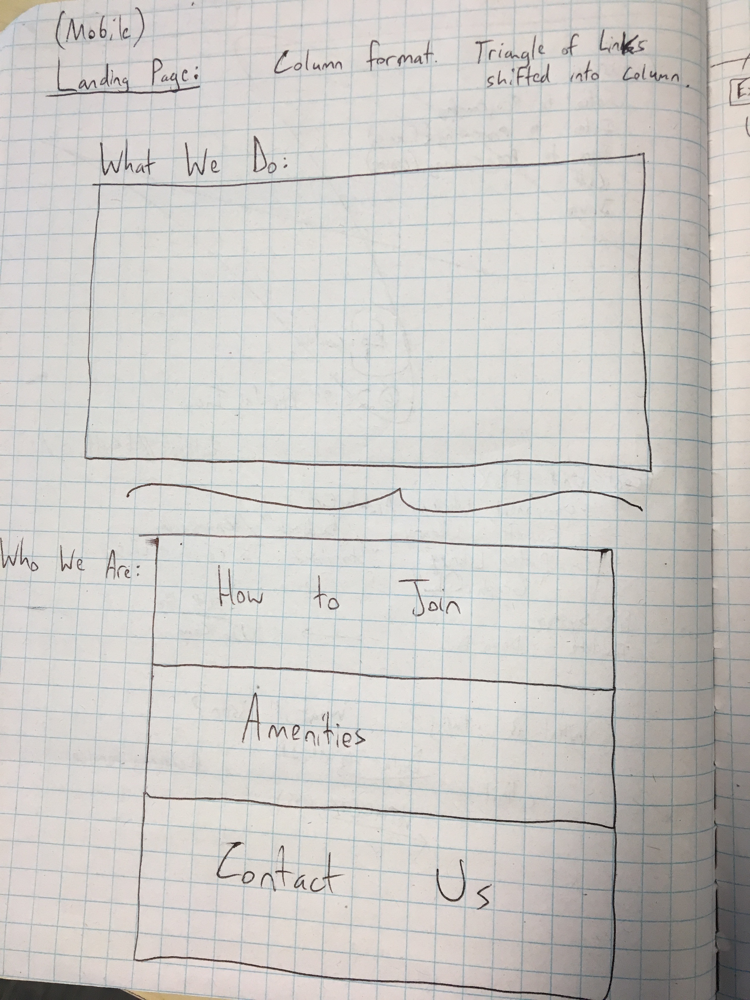
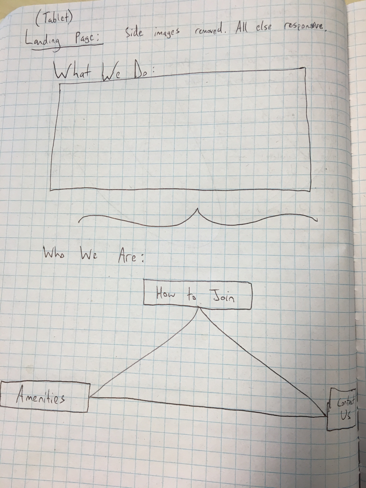
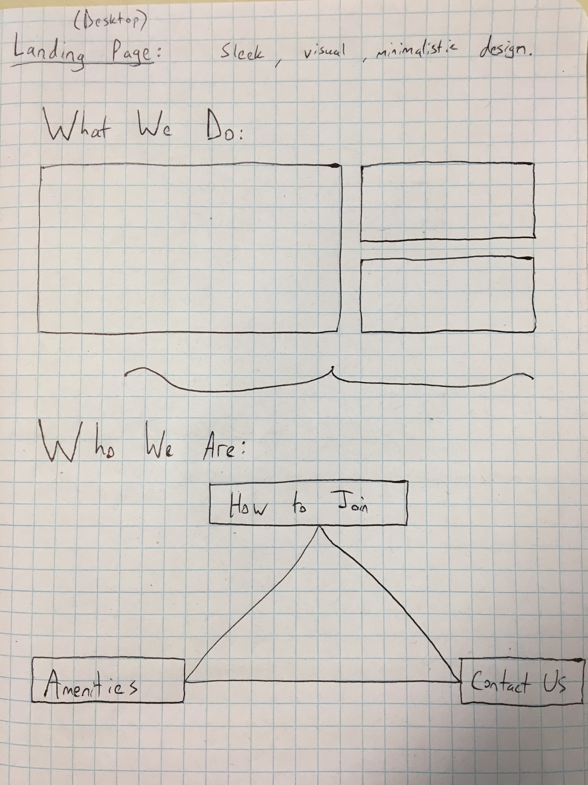
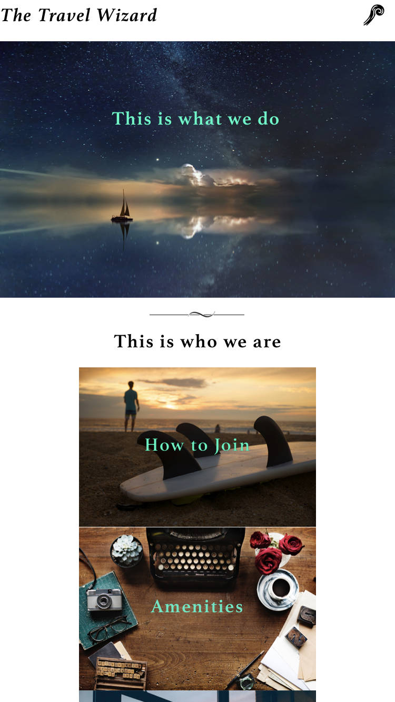
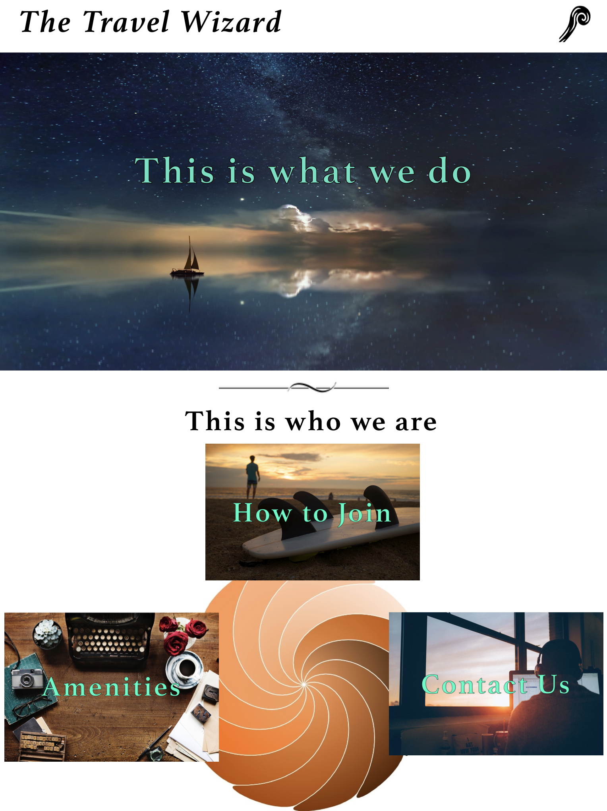
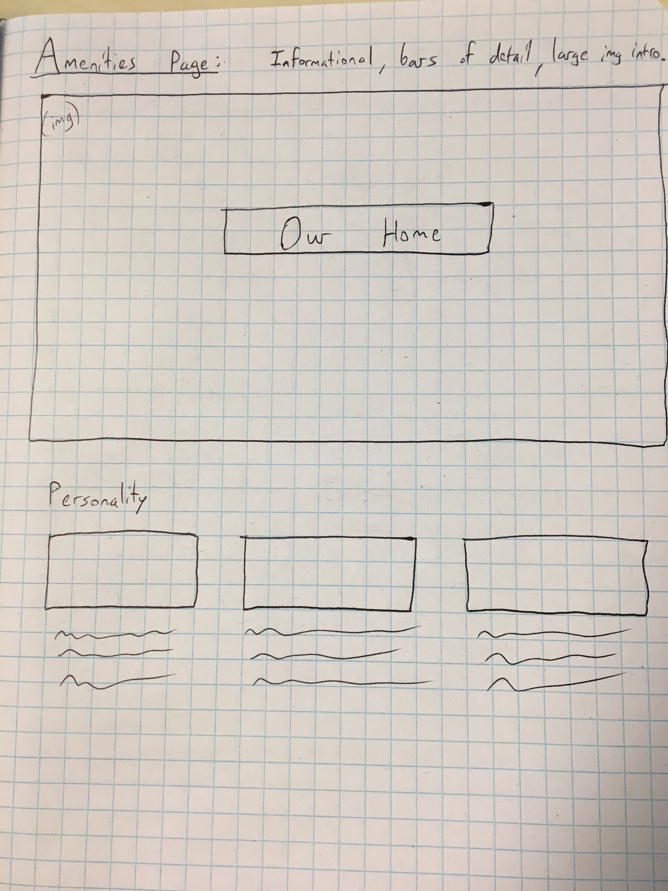
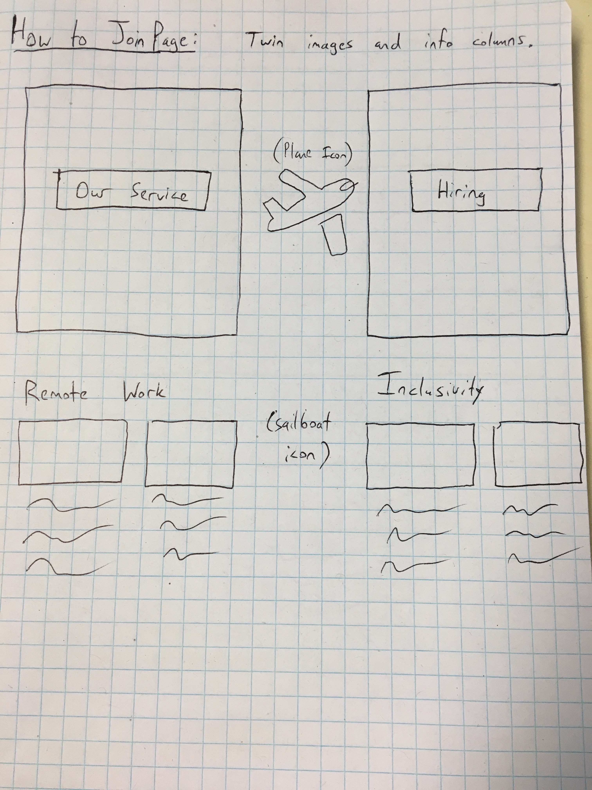
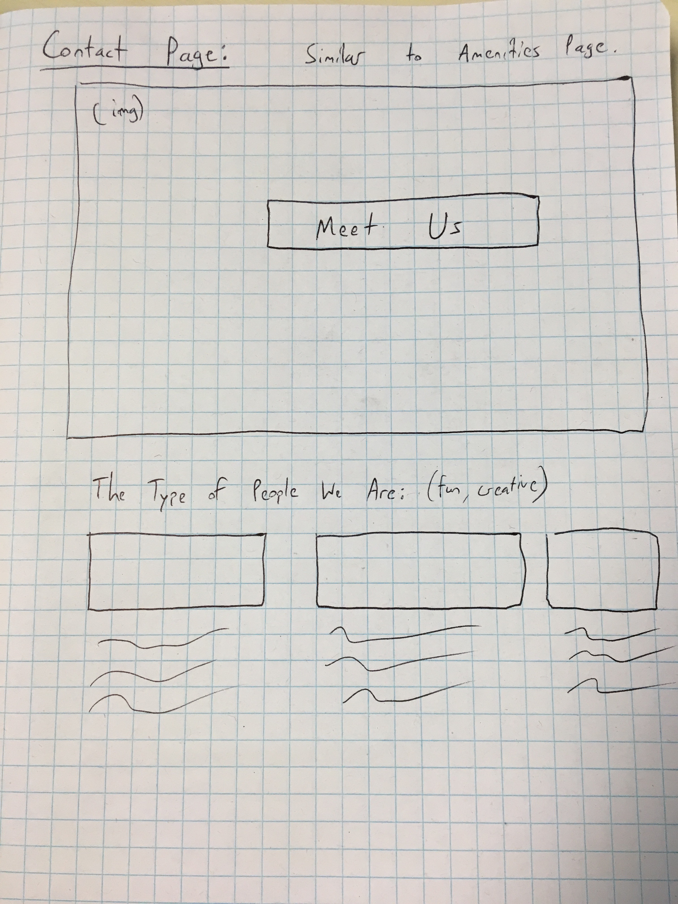
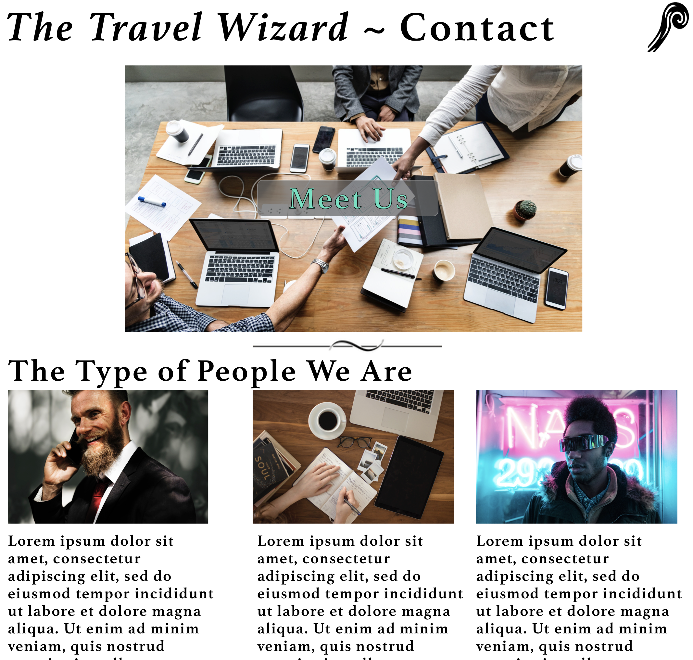

## Freelance Co-Working Contract - Travel
---

#### Ian Cook Westgate
#### 3-1-2019

### Description

This is an exercise for Epicodus in which a website is created for a fictional new co-working startup (I decided on a tech company focused on enabling travel/remote work abroad) with a variety of user priorities. The website was created through a design process featuring user stories, research, sketches of the site on paper, wireframing, prototyping, and coding.

### User Stories

* As a high-powered freelancer looking for a job with this company, I would love to see the appealing visuals of the workspace reflected in the website's presentation.
* As a politician who might want to bring the company in for a government project, I want the website to show that the company can be high-powered as well as inclusive & safe for everyone.
* As a potential investor, I want to see that the business has a unique personality that will lift it above just another boilerplate corporate atmosphere.
* As a possible CTO, I believe that the business' heavy tech day-to-day can be balanced out with the involvement of artists, writers, creatives, and craftspeople from other industries.
* As a future employee, I want an emphasis placed on the fun that can be had at work beyond the daily grind. Communal work areas, foozball tables, etc.

### Research

Given my decision to have this fictional website target a travel/remote worker business and demographic, I chose to look at a couple of websites for travel-oriented businesses to see what I could learn.

* First example: https://www.techtravelgeeks.com/

**Summary:** Tech Travel Geeks was an interesting first find. Their landing page focuses exclusively on the product which, in this case, is an intersection between tech news and travel blogging, all displayed in a visually appealing and minimalistic grid. The rest of the site is accessed through a similarly minimalistic sidebar on the left side.

**What I learned:** From this example, I would learn from their effective emphasis on travel, which you immediately gather is the point of this site and their business. However, there is zero information about their workspace and any info about inclusivity or their day-to-day functioning is almost entirely hidden. For the website I construct, that will need to be added in order to incorporate what I've learned from user stories.

* Second example: https://remoteyear.com/

**Summary:** Remote Year was a great discovery. Their landing page immediately hooks you in with a video in the background that shows what the user wants (travel throughout the world while permitting you to keep your job). Just below are more images that feature people happily traveling with links to information about how to preserve one's workspace as they do. This information with details as to how the product works continues on every subsequent page.

**What I learned:** Presentation was key here, and I was quickly blown away by the production value and seamless visual design behind the website. If that can be replicated to even the smallest degree in my own, then I'll count the website a success. That said, the workspace images featured throughout the site were confusing. At first, I thought they were workspaces of the business itself, but slowly realized that they are more likely to be simulated workspaces depicted for the benefit of the viewer (who, for this website, are seeking their own workspaces abroad). Much like Tech Travel Geeks above, there is a dearth of information and detail about how the company itself works or where it is even located.

### Images

**Landing Page**

Mobile sketch:&nbsp; 

Tablet sketch:&nbsp; 

Desktop sketch:&nbsp; 

Mobile prototype:&nbsp; 

Tablet prototype:&nbsp; 

Desktop prototype:&nbsp; 

**Amenities Page**

Amenities sketch:&nbsp; 

Amenities prototype:&nbsp; 

**How to Join Page**

How to join sketch:&nbsp; 

How to join prototype:&nbsp; 

**Contact Us Page**

Contact us sketch:&nbsp; 

Contact us prototype:&nbsp; 

#### Desktop Version

#### Mobile Version

### Technologies and Resources

* HTML
* CSS
  * SASS
* JavaScript
  * jQuery

### Responsiveness

### Setup Instructions

1. Clone this repository @ https://github.com/iwestgate931/freelance-wizard.git
2. Use a terminal of your choice (I use Git Bash) to access the webpage and its files by inputting: "git clone {the above clone link}"
3. Open the folder you receive and open the index.html link in the web browser of your choice (I use Google Chrome).

Alternatively, you can use your web browser to open the site through its GH-Pages link:

### Roadmap

Is there work you plan on continuing doing on this project? Features you'd like to add?

*
*

### License

*{This software is licensed under the MIT license}*
Copyright (c) 2019 **_{Ian Cook Westgate}_**
