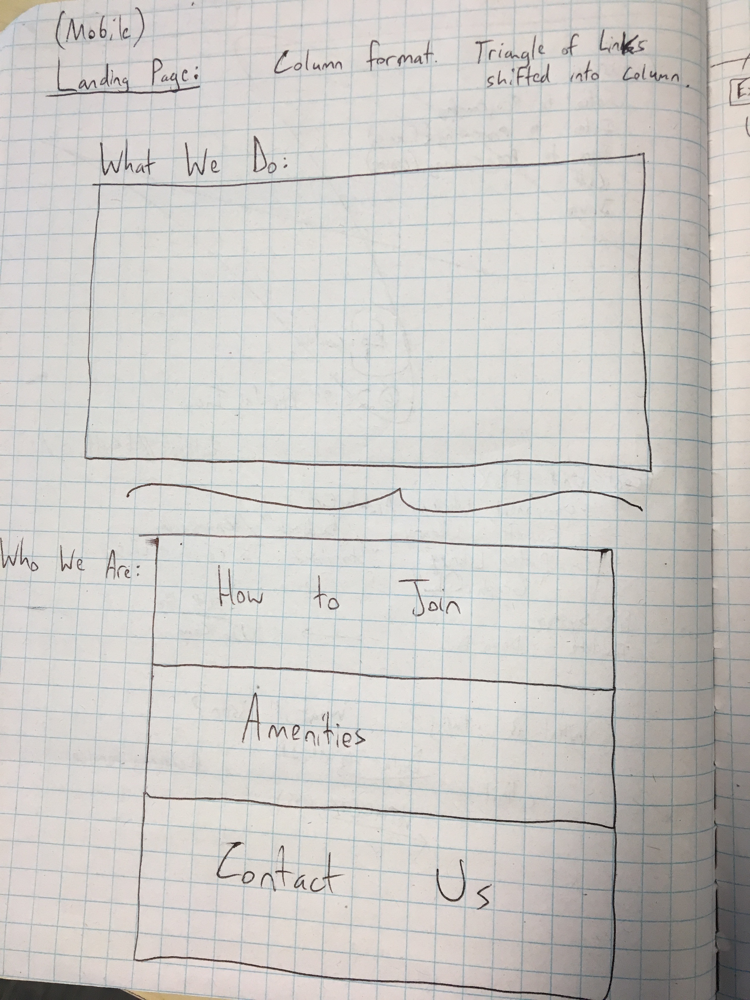
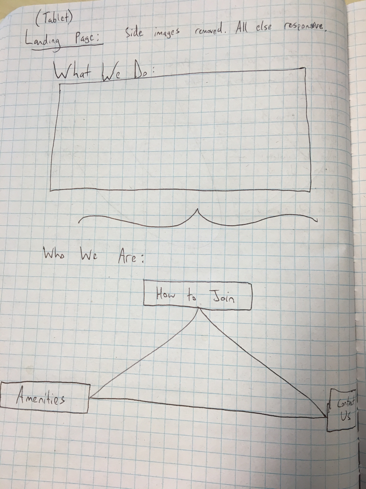
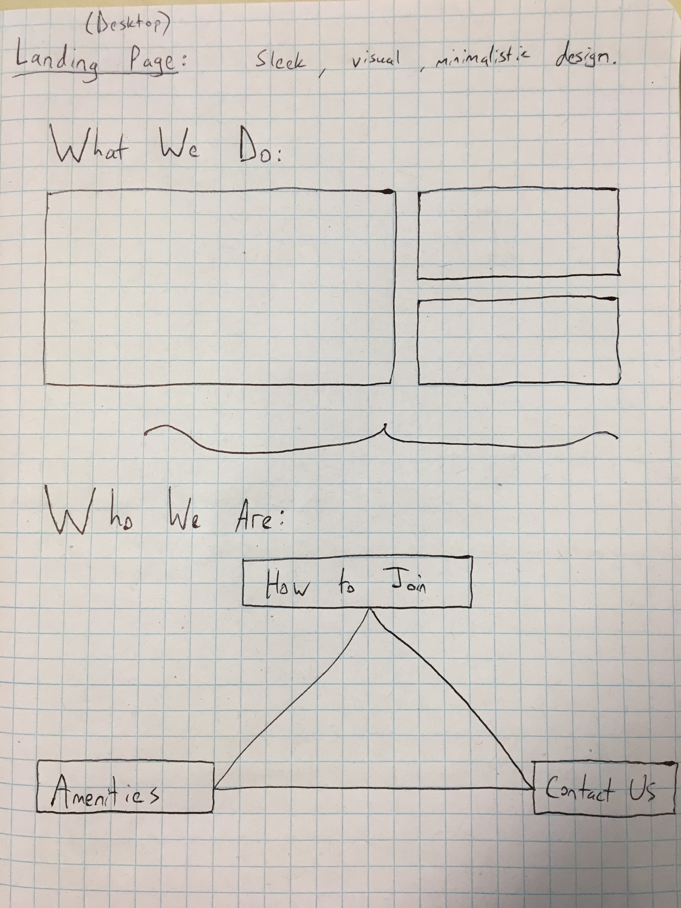
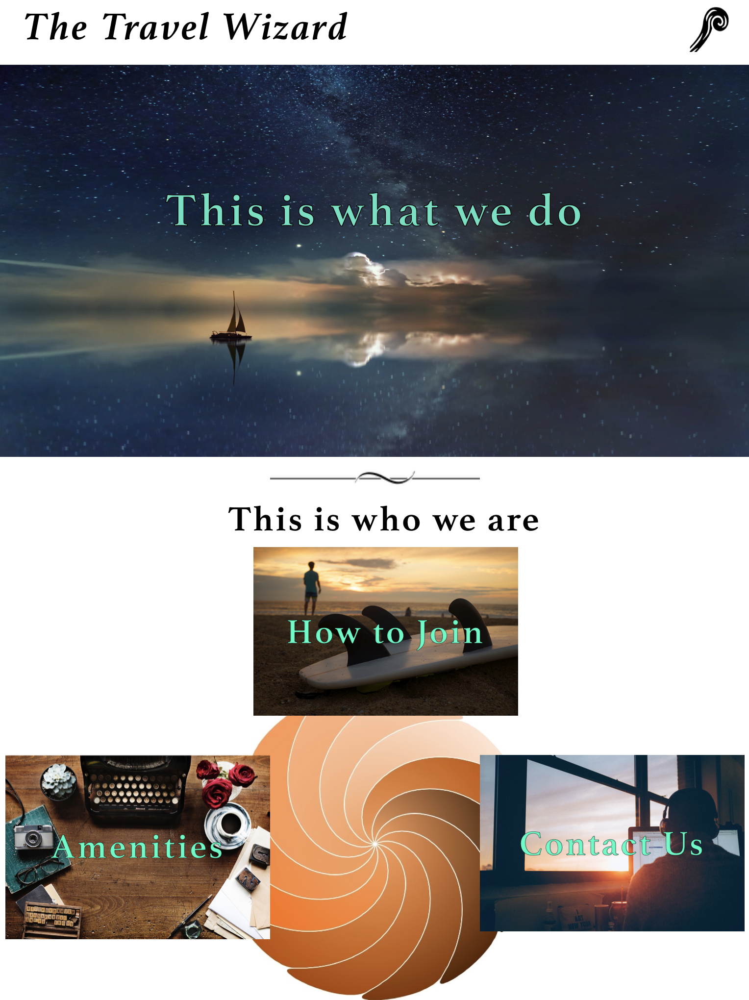
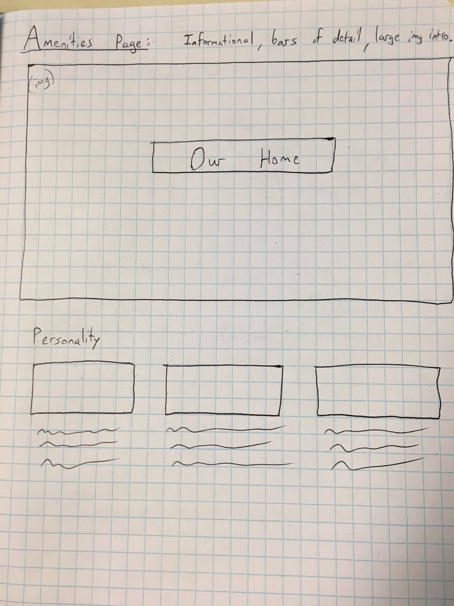
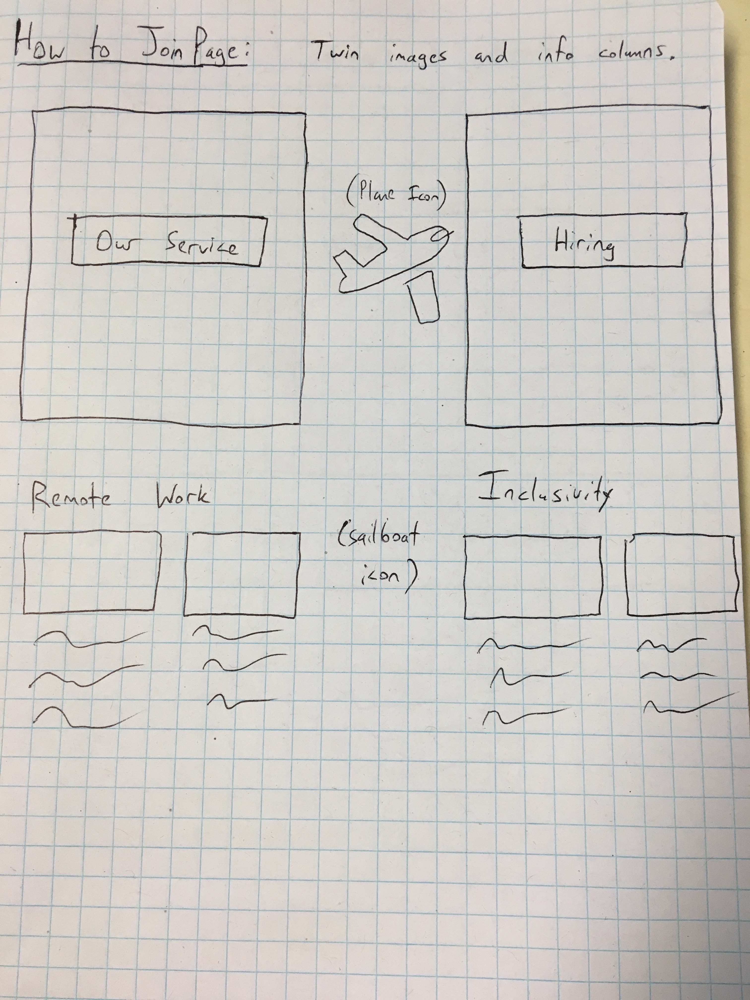
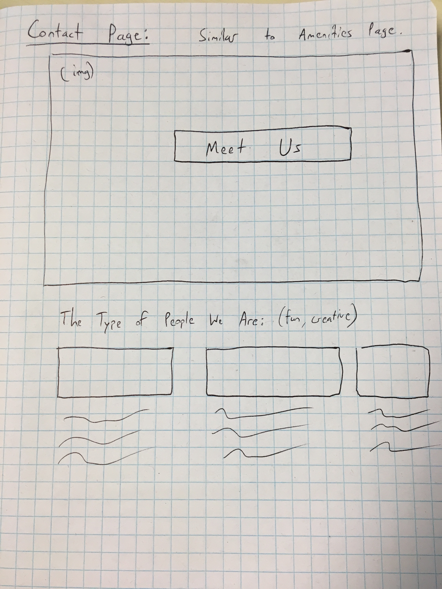
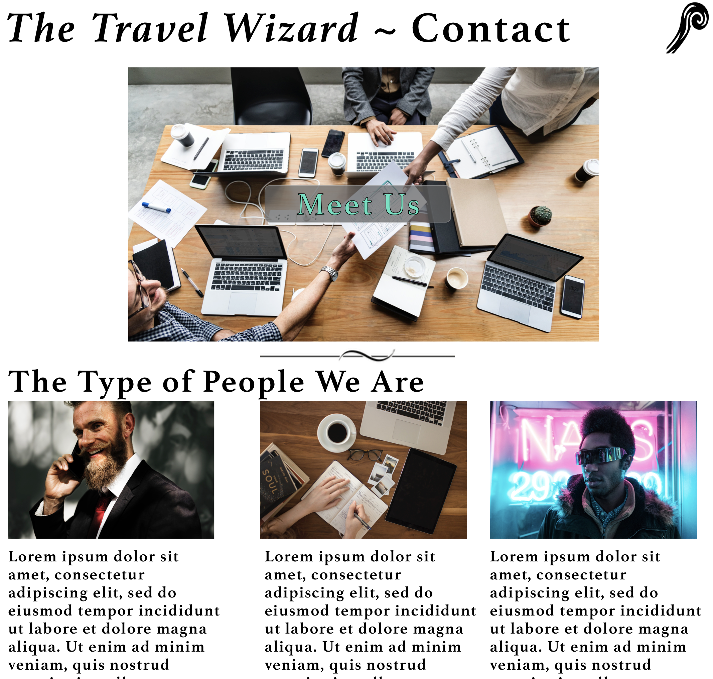
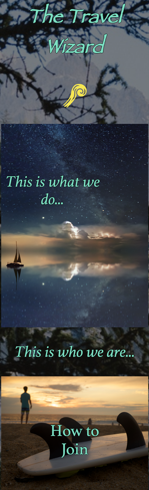

## Freelance Co-Working Contract - "The Travel Wizard"
---

#### Ian Cook Westgate
#### 3-1-2019

### Description

This is an exercise for Epicodus in which a website is created for a fictional new co-working startup (I decided on a tech company focused on enabling travel/remote work abroad) with a variety of user priorities. This website, "The Travel Wizard" was created through a design process featuring user stories, research, sketches of the site on paper, wireframing, prototyping, and coding.

### Personas

**Target Users:**

* Jimmy, the high-powered freelancer - My goal is to get hired at a company with a great looking workspace. I will use this site to find such a company. My primary pain point is websites that are so focused on their product that I can't get a sense of what working there is like.
* Senator Johnson, the politician - My goal is to find a company that can help develop a website for a government project. I will use this site to make sure that the company is cognizant of proper social decorum. My primary pain point is websites that fail to convey an open-arms presentation that is welcoming to all users.
* Eduardo, the potential investor - My goal is to invest in a company with a unique personality that elevates it above the typical competitor. I will use this site to look for a unique work culture. My primary pain point is websites that look like just-another-corporation and fail to make themselves distinct from their competition.
* Viola, the possible CTO - My goal is to work at a company that balances their tech work with the involvement of professionals across the creative spectrum. I will use this site to find evidence of a balanced workforce that can breathe outside of just another collection of tech workers. My primary pain point is websites that are excessively tech focused.
* Gertrude, the future employee - My goal is to get a job at a company that knows how to have fun in addition to the everyday work. I will use this site to find signs of a friendly and exciting workspace where I can relax when I need to. My primary pain point is websites that display themselves as being so professional that you wonder if they get any breaks at all.

### User Stories

* As a high-powered freelancer looking for a job with this company, I would love to see the appealing visuals of the workspace reflected in the website's presentation.
* As a politician who might want to bring the company in for a government project, I want the website to show that the company can be high-powered, inclusive & safe for everyone at the same time.
* As a potential investor, I want to see that the business has a unique personality that will lift it above having just another boilerplate corporate vibe.
* As a possible CTO, I believe that the business' heavy tech day-to-day business can be balanced out with the involvement and featuring of artists, writers, creatives, & craftspeople from other industries.
* As a future employee, I want an emphasis placed on the fun that can be had at work beyond the daily grind.

### Research

Given my decision to have this fictional website target a travel/remote worker business and demographic, I chose to look at a couple of websites for travel-oriented businesses to see what I could learn.

**First example:** https://www.techtravelgeeks.com/

* Summary: Tech Travel Geeks was an interesting first find. Their landing page focuses exclusively on the product which, in this case, is an intersection between tech news and travel blogging, all displayed in a visually appealing and minimalistic grid. The rest of the site is accessed through a similarly minimalistic sidebar on the left side.

* What I learned: From this example, I would learn from their effective emphasis on travel, which you immediately gather is the point of this site and their business. However, there is zero information about their workspace and any info about inclusivity or their day-to-day functioning is almost entirely hidden. For the website I construct, that will need to be added in order to incorporate what I've learned from user stories.

**Second example:** https://remoteyear.com/

* Summary: Remote Year was a great discovery. Their landing page immediately hooks you in with a video in the background that shows what the user wants (travel throughout the world while permitting you to keep your job). Just below are more images that feature people happily traveling with links to information about how to preserve one's workspace as they do. This information with details as to how the product works continues on every subsequent page.

* What I learned: Presentation was key here, and I was quickly blown away by the production value and seamless visual design behind the website. If that can be replicated to even the smallest degree in my own, then I'll count the website a success. That said, the workspace images featured throughout the site were confusing. At first, I thought they were workspaces of the business itself, but slowly realized that they are more likely to be simulated workspaces depicted for the benefit of the viewer (who, for this website, are seeking their own workspaces abroad). Much like Tech Travel Geeks above, there is a dearth of information and detail about how the company itself works or where it is even located.

### Images

**Landing Page**

Mobile sketch: 
 

Tablet sketch: 
 

Desktop sketch: 
 

Mobile prototype: 
 

Tablet prototype: 
 

Desktop prototype: 
 

**Amenities Page**

Amenities sketch: 
 

Amenities prototype: 
 

**How to Join Page**

How to Join sketch: 
 

How to Join prototype: 
 

**Contact Us Page**

Contact Us sketch: 
 

Contact Us prototype: 
 

#### Desktop Version

#### Mobile Version

### Technologies and Resources

* HTML
* CSS
  * Sass
* JavaScript
  * jQuery
* Sketch
* Webpack

### Setup Instructions

1. Clone this repository @ https://github.com/iwestgate931/freelance-wizard.git
2. Use a terminal of your choice (I use Git Bash) to access the webpage and its files by moving to the desktop ("cd Desktop") and then inputting: "git clone {the above clone link}".
3. Navigate to the folder in the terminal by typing in: "cd freelance-wizard".
4. Use the terminal to install node.js by typing in: "npm install".
5. Use the terminal to launch the project into your web browser to be viewed by typing in: "npm run start".

### Roadmap

Is there work you plan on continuing doing on this project? Features you'd like to add?

* I would like to add more uniqueness to both the Amenities and/or Contact pages. Currently, their structure is very similar.
* I would try to nuance the grid on the How to Join page so that it appears more aesthetically pleasing as the width of the page decreases.
* I would like to add a dropdown menu to the staff icon in the upper right that would provide access to all the various pages so that one does not have to return to the home page in order to go elsewhere.
* I would find a way to better hint at the work environment on the Index/Home page instead of reserving all of those visuals and information to other pages on the site.

### License

*{This software is licensed under the MIT license}*
Copyright (c) 2019 **_{Ian Cook Westgate}_**
